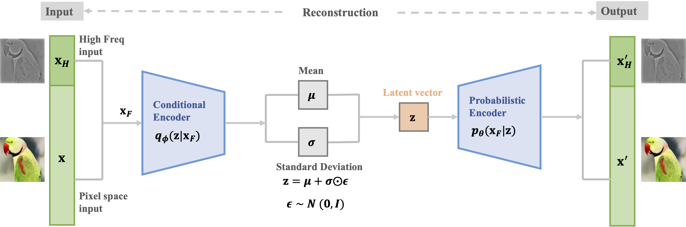

# Out-of-distribution Detection via Frequency-regularized Generative Models [WACV 2023 **Highlight** ]

This is the source code for our WACV 2023 **Highlight** paper [Out-of-distribution Detection via Frequency-regularized Generative Models](https://arxiv.org/abs/2208.09083)
by Mu Cai, and Yixuan Li. The main idea and code are **heavily borrowed from** [Frequency Domain Image Translation: More Photo-realistic, Better Identity-preserving](https://github.com/mu-cai/frequency-domain-image-translation/). 

<div align="center">
  
</div>


## Citation
```
@inproceedings{cai-wacv2023,
  title = {Out-of-distribution Detection via Frequency-regularized Generative Models},
  author = {Cai, Mu and Li, Yixuan},
  booktitle = {Winter Conference on Applications of Computer Vision (WACV)},
  year = {2023}
}
```


## Usuage

Here we provide the VAE trained on CIFAR-10 as an example. 

###  Downloading Out-of-distribution Test Datasets

We provide links and instructions to download the dataset:

* [LSUN](https://www.dropbox.com/s/moqh2wh8696c3yl/LSUN_resize.tar.gz)
* [NotMNIST](https://www.kaggle.com/trolleyproblem/notmnist-small)

Download them and place them in the folder of `./data`.
For all the other datasets, PyTorch will automatically download them for you.


###  Prepare the environment

It is tested under Ubuntu Linux 20.04 and Python 3.8 environment, and requires some packages to be installed:

* [PyTorch](https://pytorch.org/)
* [numpy](http://www.numpy.org/)
* [sklearn](https://scikit-learn.org/stable/)
* tqdm
* opencv-python

Using ``pip`` to install such packages is fine. 


### Train the model

To train a frequency-regularized VAE model, use the following command:


```
cd train_VAE
python train_VAE_freq.py
```


Alternatively, you can download a pretrained checkpoint [here](https://drive.google.com/file/d/1e-dG-s6zdIdg3xlXtj7pcTyFbFg9G5U2/view?usp=share_link), and put it under ``./saved_models/VAE_cifar10``.


### Evaluate the AUROC and Efficiency


To evaluate the AUROC, use the following command:

```
cd train_VAE
python compute_AUROC.py
```

You will get the average AUROC of 0.908 on all of the OOD datasets.


Code is modified from [Frequency Domain Image Translation: More Photo-realistic, Better Identity-preserving](https://github.com/mu-cai/frequency-domain-image-translation/)m [Likelihood Regret](https://github.com/XavierXiao/Likelihood-Regret), and
[ROSE](https://github.com/shinypond/ood_detection).


